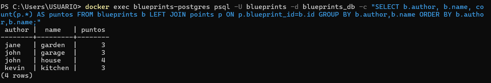
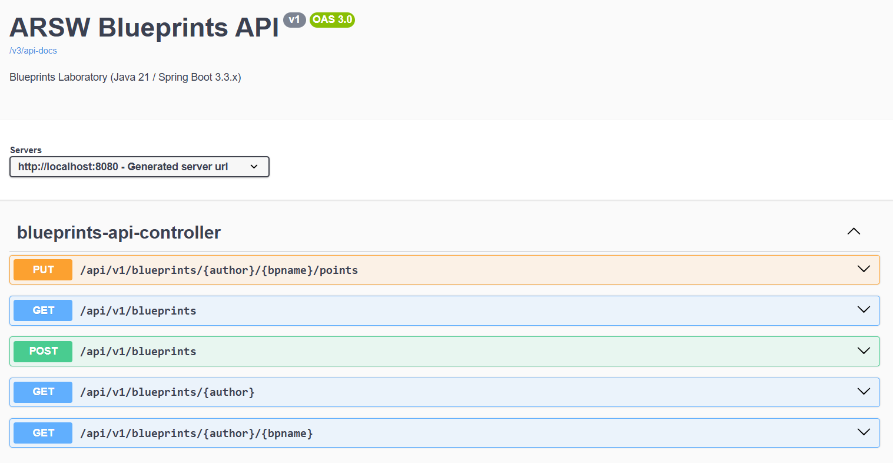

## Laboratorio #4 – REST API Blueprints (Java 21 / Spring Boot 3.3.x)
# Escuela Colombiana de Ingeniería – Arquitecturas de Software  

---

## 📋 Requisitos
- Java 21
- Maven 3.9+

## ▶️ Ejecución del proyecto
```bash
mvn clean install
mvn spring-boot:run
```
Probar con `curl`:
```bash
curl -s http://localhost:8080/blueprints | jq
curl -s http://localhost:8080/blueprints/john | jq
curl -s http://localhost:8080/blueprints/john/house | jq
curl -i -X POST http://localhost:8080/blueprints -H 'Content-Type: application/json' -d '{ "author":"john","name":"kitchen","points":[{"x":1,"y":1},{"x":2,"y":2}] }'
curl -i -X PUT  http://localhost:8080/blueprints/john/kitchen/points -H 'Content-Type: application/json' -d '{ "x":3,"y":3 }'
```

> Si deseas activar filtros de puntos (reducción de redundancia, *undersampling*, etc.), implementa nuevas clases que implementen `BlueprintsFilter` y cámbialas por `IdentityFilter` con `@Primary` o usando configuración de Spring.
---

Abrir en navegador:  
- Swagger UI: [http://localhost:8080/swagger-ui.html](http://localhost:8080/swagger-ui.html)  
- OpenAPI JSON: [http://localhost:8080/v3/api-docs](http://localhost:8080/v3/api-docs)  

---

## 🗂️ Estructura de carpetas (arquitectura)

```
src/main/java/edu/eci/arsw/blueprints
  ├── model/         # Entidades de dominio: Blueprint, Point
  ├── persistence/   # Interfaz + repositorios (InMemory, Postgres)
  │    └── impl/     # Implementaciones concretas
  ├── services/      # Lógica de negocio y orquestación
  ├── filters/       # Filtros de procesamiento (Identity, Redundancy, Undersampling)
  ├── controllers/   # REST Controllers (BlueprintsAPIController)
  └── config/        # Configuración (Swagger/OpenAPI, etc.)
```

> Esta separación sigue el patrón **capas lógicas** (modelo, persistencia, servicios, controladores), facilitando la extensión hacia nuevas tecnologías o fuentes de datos.

---

## 📖 Actividades del laboratorio

### 1. Familiarización con el código base
- Revisa el paquete `model` con las clases `Blueprint` y `Point`.  
- Entiende la capa `persistence` con `InMemoryBlueprintPersistence`.  
- Analiza la capa `services` (`BlueprintsServices`) y el controlador `BlueprintsAPIController`.

### 2. Migración a persistencia en PostgreSQL
- Configura una base de datos PostgreSQL (puedes usar Docker).  
- Implementa un nuevo repositorio `PostgresBlueprintPersistence` que reemplace la versión en memoria.  
- Mantén el contrato de la interfaz `BlueprintPersistence`.  

### 3. Buenas prácticas de API REST
- Cambia el path base de los controladores a `/api/v1/blueprints`.  
- Usa **códigos HTTP** correctos:  
  - `200 OK` (consultas exitosas).  
  - `201 Created` (creación).  
  - `202 Accepted` (actualizaciones).  
  - `400 Bad Request` (datos inválidos).  
  - `404 Not Found` (recurso inexistente).  
- Implementa una clase genérica de respuesta uniforme:
  ```java
  public record ApiResponse<T>(int code, String message, T data) {}
  ```
  Ejemplo JSON:
  ```json
  {
    "code": 200,
    "message": "execute ok",
    "data": { "author": "john", "name": "house", "points": [...] }
  }
  ```

### 4. OpenAPI / Swagger
- Configura `springdoc-openapi` en el proyecto.  
- Expón documentación automática en `/swagger-ui.html`.  
- Anota endpoints con `@Operation` y `@ApiResponse`.

### 5. Filtros de *Blueprints*
- Implementa filtros:
  - **RedundancyFilter**: elimina puntos duplicados consecutivos.  
  - **UndersamplingFilter**: conserva 1 de cada 2 puntos.  
- Activa los filtros mediante perfiles de Spring (`redundancy`, `undersampling`).  

---

## ✅ Entregables

1. Repositorio en GitHub con:  
   - Código fuente actualizado.  
   - Configuración PostgreSQL (`application.yml` o script SQL).  
   - Swagger/OpenAPI habilitado.  
   - Clase `ApiResponse<T>` implementada.  

2. Documentación:  
   - Informe de laboratorio con instrucciones claras.  
   - Evidencia de consultas en Swagger UI y evidencia de mensajes en la base de datos.  
   - Breve explicación de buenas prácticas aplicadas.  

---

## 📊 Criterios de evaluación

| Criterio | Peso |
|----------|------|
| Diseño de API (versionamiento, DTOs, ApiResponse) | 25% |
| Migración a PostgreSQL (repositorio y persistencia correcta) | 25% |
| Uso correcto de códigos HTTP y control de errores | 20% |
| Documentación con OpenAPI/Swagger + README | 15% |
| Pruebas básicas (unitarias o de integración) | 15% |

**Bonus**:  

- Imagen de contenedor (`spring-boot:build-image`).  
- Métricas con Actuator.  

---

## SOLUCIÓN

A continuación se documenta el desarrollo realizado para el Laboratorio 3, incluyendo la carga de la base de datos para la evaluación.

### 1. Cómo cargar/levantar la base de datos (requisito de evaluación)

La base de datos PostgreSQL se levanta con Docker Compose. El esquema (`blueprints`, `points`) y los datos semilla se crean automáticamente la primera vez que se inicia el contenedor, mediante el script [`init-db/init.sql`](init-db/init.sql) montado en `/docker-entrypoint-initdb.d/`.

```bash
# 1. Levantar PostgreSQL en Docker (crea volumen, red y ejecuta init-db/init.sql)
docker compose up -d

# 2. Verificar que el contenedor esté healthy
docker compose ps

# 3. (Opcional) Verificar el esquema y los datos semilla
docker exec blueprints-postgres psql -U blueprints -d blueprints_db -c "\dt"
docker exec blueprints-postgres psql -U blueprints -d blueprints_db -c "SELECT author, name FROM blueprints;"
```

Credenciales/DB definidas en [`docker-compose.yml`](docker-compose.yml):

| Variable | Valor |
|---|---|
| `POSTGRES_USER` | `blueprints` |
| `POSTGRES_PASSWORD` | `blueprints` |
| `POSTGRES_DB` | `blueprints_db` |
| Puerto expuesto | `5432` |

```bash
# 4. Ejecutar la aplicación apuntando a PostgreSQL (perfil "postgres")
mvn spring-boot:run -Dspring-boot.run.profiles=postgres
```

> Si se corre `mvn spring-boot:run` **sin** el perfil `postgres`, la app usa la persistencia en memoria original (no requiere Docker). Esto se logró excluyendo la autoconfiguración de `DataSource`/`JdbcTemplate` por defecto en [`application.properties`](src/main/resources/application.properties) y reactivándola solo en [`application-postgres.properties`](src/main/resources/application-postgres.properties), de forma que `mvn clean install` (tests) siga funcionando sin Docker levantado.

Para bajar y limpiar el contenedor y el volumen:
```bash
docker compose down -v
```

### 2. Migración a PostgreSQL

- Se creó [`PostgresBlueprintPersistence`](src/main/java/edu/eci/arsw/blueprints/persistence/postgres/PostgresBlueprintPersistence.java), que implementa la interfaz `BlueprintPersistence` usando `JdbcTemplate` (sin ORM) contra las tablas `blueprints` y `points`.
- Se activa con el perfil de Spring `postgres` (`@Profile("postgres")`); `InMemoryBlueprintPersistence` quedó anotada con `@Profile("!postgres")` para que ambas implementaciones convivan sin chocar (patrón Strategy, misma interfaz).
- Esquema y datos semilla (mismos blueprints de ejemplo que la versión en memoria: `john/house`, `john/garage`, `jane/garden`) en [`init-db/init.sql`](init-db/init.sql).

### 3. API REST versionada y respuesta uniforme

- Path base cambiado de `/blueprints` a **`/api/v1/blueprints`** en [`BlueprintsAPIController`](src/main/java/edu/eci/arsw/blueprints/controllers/BlueprintsAPIController.java).
- Se implementó `record ApiResponse<T>(int code, String message, T data)` en [`web/ApiResponse.java`](src/main/java/edu/eci/arsw/blueprints/web/ApiResponse.java) y todos los endpoints devuelven las respuestas envueltas en este record.
- Se agregó [`GlobalExceptionHandler`](src/main/java/edu/eci/arsw/blueprints/web/GlobalExceptionHandler.java) (`@RestControllerAdvice`) que centraliza el mapeo de excepciones a códigos HTTP:

| Caso | Código |
|---|---|
| `GET /api/v1/blueprints` (todos) | `200 OK` |
| `GET /api/v1/blueprints/{author}` | `200 OK` / `404 Not Found` |
| `GET /api/v1/blueprints/{author}/{name}` | `200 OK` / `404 Not Found` |
| `POST /api/v1/blueprints` (crear) | `201 Created` / `400 Bad Request` (duplicado o validación `@NotBlank`) |
| `PUT /api/v1/blueprints/{author}/{name}/points` (agregar punto) | `202 Accepted` / `404 Not Found` |

Evidencia (probado contra la base de datos levantada con Docker, perfil `postgres`):

```bash
$ curl -s http://localhost:8080/api/v1/blueprints
{"code":200,"message":"execute ok","data":[{"author":"john","name":"house","points":[...]}, ...]}

$ curl -s -w "\nHTTP:%{http_code}\n" -X POST http://localhost:8080/api/v1/blueprints \
  -H 'Content-Type: application/json' \
  -d '{ "author":"kevin","name":"kitchen","points":[{"x":1,"y":1},{"x":2,"y":2}] }'
{"code":201,"message":"blueprint created","data":{"author":"kevin","name":"kitchen","points":[...]}}
HTTP:201

$ curl -s -w "\nHTTP:%{http_code}\n" -X PUT http://localhost:8080/api/v1/blueprints/kevin/kitchen/points \
  -H 'Content-Type: application/json' -d '{ "x":3,"y":3 }'
{"code":202,"message":"point added","data":null}
HTTP:202

$ curl -s -w "\nHTTP:%{http_code}\n" http://localhost:8080/api/v1/blueprints/nadie/nada
{"code":404,"message":"Blueprint not found: nadie/nada","data":null}
HTTP:404
```

### 4. OpenAPI / Swagger

Ya configurado con `springdoc-openapi` ([`config/OpenApiConfig.java`](src/main/java/edu/eci/arsw/blueprints/config/OpenApiConfig.java)) y verificado en ejecución:
- Swagger UI: http://localhost:8080/swagger-ui/index.html (`200 OK`)
- OpenAPI JSON: http://localhost:8080/v3/api-docs (refleja el path `/api/v1/blueprints`)

### 5. Filtros de Blueprints por perfil

- `RedundancyFilter` (perfil `redundancy`) y `UndersamplingFilter` (perfil `undersampling`) ya existían en el proyecto base.
- **Bug corregido**: `IdentityFilter` no tenía restricción de perfil, por lo que al activar `redundancy` o `undersampling` Spring encontraba **dos** beans `BlueprintsFilter` candidatos y la app no arrancaba (`required a single bean, but 2 were found`). Se corrigió agregando `@Profile("!redundancy & !undersampling")` en [`IdentityFilter`](src/main/java/edu/eci/arsw/blueprints/filters/IdentityFilter.java).
- Verificado en ejecución:

```bash
# Perfil redundancy — elimina puntos consecutivos duplicados
mvn spring-boot:run -Dspring-boot.run.profiles=postgres,redundancy
# entrada: [(1,1),(1,1),(2,2),(2,2),(3,3)] -> salida filtrada: [(1,1),(2,2),(3,3)]

# Perfil undersampling — conserva 1 de cada 2 puntos
mvn spring-boot:run -Dspring-boot.run.profiles=postgres,undersampling
# entrada: [(0,0),(1,1),(2,2),(3,3),(4,4)] -> salida filtrada: [(0,0),(2,2),(4,4)]
```

### 6. Resumen de archivos añadidos/modificados

| Archivo | Cambio |
|---|---|
| `docker-compose.yml` | Nuevo — levanta PostgreSQL con volumen persistente y healthcheck |
| `init-db/init.sql` | Nuevo — esquema `blueprints`/`points` + datos semilla |
| `pom.xml` | + `spring-boot-starter-jdbc`, + driver `org.postgresql:postgresql` |
| `src/main/resources/application.properties` | Excluye autoconfig de datasource por defecto (permite correr sin Docker) |
| `src/main/resources/application-postgres.properties` | Nuevo — config de conexión a PostgreSQL |
| `persistence/InMemoryBlueprintPersistence.java` | + `@Profile("!postgres")` |
| `persistence/postgres/PostgresBlueprintPersistence.java` | Nuevo — implementación JDBC de `BlueprintPersistence` |
| `filters/IdentityFilter.java` | Fix: `@Profile("!redundancy & !undersampling")` |
| `web/ApiResponse.java` | Nuevo — record de respuesta uniforme |
| `web/GlobalExceptionHandler.java` | Nuevo — mapeo centralizado de excepciones a códigos HTTP |
| `controllers/BlueprintsAPIController.java` | Path `/api/v1/blueprints`, respuestas envueltas en `ApiResponse<T>`, códigos HTTP correctos |

### 7. Estado final

- `mvn clean install` (perfil por defecto, sin Docker): **BUILD SUCCESS**, tests en verde.
- `docker compose up -d`: contenedor `blueprints-postgres` healthy.
- `mvn spring-boot:run -Dspring-boot.run.profiles=postgres`: API funcionando end-to-end contra PostgreSQL, Swagger UI accesible, todos los endpoints y códigos HTTP verificados con `curl`.
 
 ## Evidencias fotograficas 



